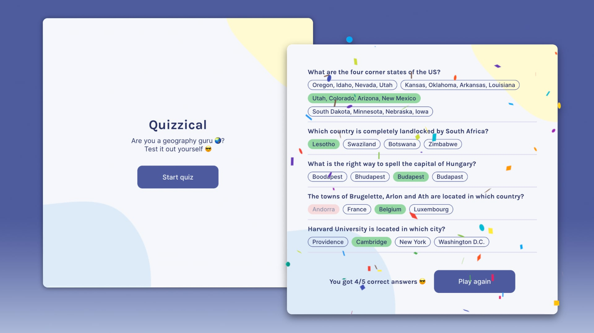

# About
This is a mini geography quiz game created using ReactJS. The API used is from [Open Trivia Database](https://opentdb.com/api_config.php).

And by "mini", I mean it got 5 quizzes each round 😊. You can easily modify the number of quizzes in the source code, in the `APIUrlConstants` file.

# Screenshot

# Get Started
<ol>
    <li>
        Install <code><a href="https://nodejs.org/en/">NodeJS</a></code> and <code>npm</code>
    </li>
    <li>
        Open your CLI, navigate to the root folder of this project
    </li>
    <li>
        Enter <code>npm install</code>
    </li>
    <li>
        Enter <code>npm start</code>
    </li>
</ol>